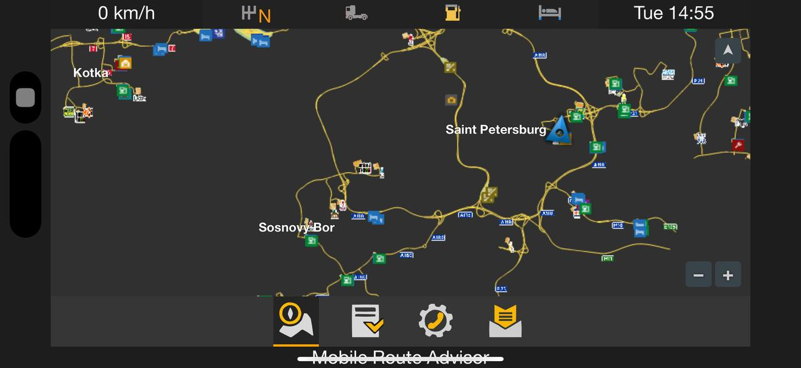
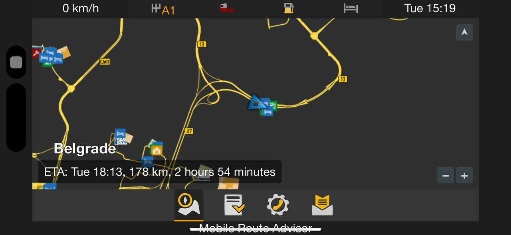
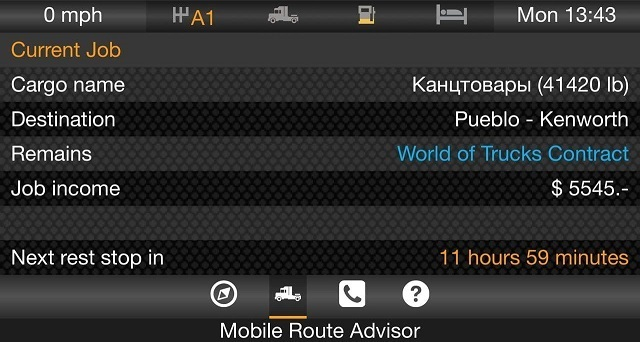
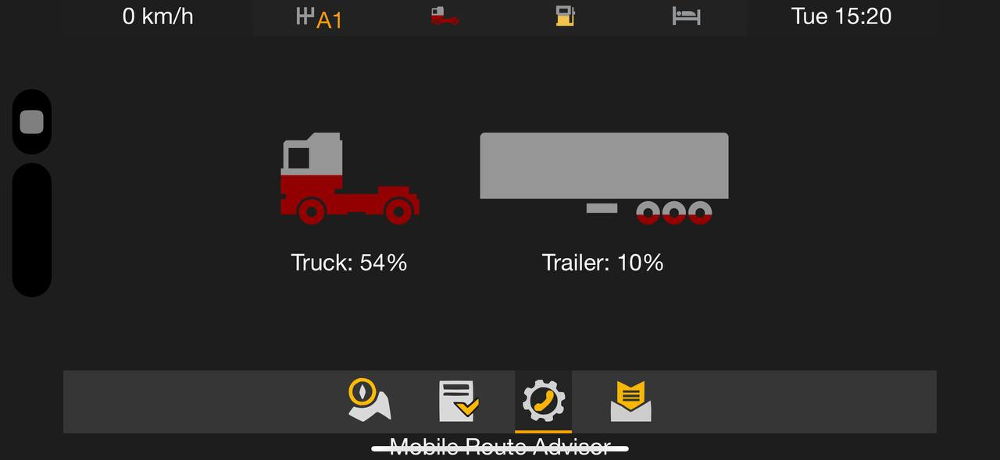

# ETS2 / ATS Mobile Route Advisor   

## EN:
Euro Truck Simulator 2 / American Truck Simulator's Route Advisor, for mobile devices.
This is a skin for [ETS2 Telemetry Server 4.1.2.3+](https://github.com/PauloTNCunha/TelemetryServer4)

## Features
> Notice #1: Map contains POI directly on the map images (if the Map follows the driving direction, these icons do NOT rotate).

> Notice #2: Flags have been disabled due to poor map performance when displaying them. You can enable them if needed by uncommenting the lines in the map.js
- Navigation
    - Mini-map (ETS2 & ATS)
    - Truck label is pinned in the center, the map rotates if the truck rotates in relation to the parts of the light (N, S, E, W)
    - Pinned map, the truck label is rotated on the map if the position of the truck changes in relation to the parts of the light
    - Free view/rotate/zoom
    - Auto zoom map depending on speed
    - Speed limit
    - Distance Remaining
    - Estimated time of arrival (ETA)
    - Time to destination
- Current job information
    - Current load
    - Destination city
    - Payout
    - Time remaining
    - Time until next rest
- Truck damage / load damage
- Localization support

ETS 2 inclued:
- DLC Going East
- DLC Scandinavia
- DLC Vive La France
- DLC Italia
- DLC Beyond the Baltic Sea
- DLC Road to the Black Sea
- DLC Iberia
- DLC Heart of Russia - _release date unknown TBA_

ATS inclued:
- DLC Arizona
- DLC New Mexico
- DLC Oregon
- DLC Washington
- DLC Utah
- DLC Idaho
- DLC Colorado
- DLC Wyoming
- DLC Montana
- DLC Texas

## Requirements
- Euro Truck Simulator 2 and/or American Truck Simulator v1.48
- [ETS2 Telemetry Server](https://github.com/PauloTNCunha/TelemetryServer4) 4.1.2.3+

## How to Install
1. First, download and install ETS2 Telemetry Server. After, download the latest version of the Mobile Route Advisor from the [releases page](https://www.github.com/meatlayer/ets2-mobile-route-advisor/releases).
2. Extract the contents of the zip to the ETS2 Telemetry Server's `\Telemetry Server\Html\skins\ets2-mobile-route-advisor` directory. You should then have a folder named `ets2-mobile-route-advisor` in the `skins` directory.

## RU:
Euro Truck Simulator 2 / American Truck Simulator's Route Advisor - Навигатор для мобильных устройств (работает через браузер).
Это готовый скин для сервера телеметрии - [ETS2 Telemetry Server 4.1.2.3+](https://github.com/PauloTNCunha/TelemetryServer4)

## Возможности
> Обратите внимание #1: Карта содержит POI-значки непосредственно на изображениях карты (если карта следует направлению движения, эти значки НЕ вращаются).

> Обратите внимание #2: Флаги были отключены из-за плохой производительности карты при их отображении. Вы можете включить их, если это необходимо, раскомментировав строки в map.js

- Навигация
     - Мини-карта (ETS2 и ATS)
     - Фиксация метки грузовика в центре, карта поворачивается, если грузовик поворачивается по отношению к частям света (С, Ю, З, В)
     - Фиксация карты, метка грузовика поворачивается на карте, если положение грузовика изменяется по отношению к частям света
     - Свободный просмотр / поворот / масштабирование
     - Автоматическое масштабирование карты в зависимости от скорости
     - Ограничение скорости
     - Оставшееся расстояние
     - Расчетное время прибытия (ETA)
     - Время до пункта назначения
- Текущая информация о грузе
     - Вес груза
     - Город назначения
     - Стоимость
     - Оставшееся время (ETA)
     - Время до следующего отдыха
- Повреждение грузовика / повреждение груза
- Поддержка локализации 

ETS 2 в составе карты:
- DLC Going East
- DLC Scandinavia
- DLC Vive La France
- DLC Italia
- DLC Beyond the Baltic Sea
- DLC Road to the Black Sea
- DLC Iberia
- DLC Heart of Russia - _release date unknown TBA_

ATS в составе карты:
- DLC Arizona
- DLC New Mexico
- DLC Oregon
- DLC Washington
- DLC Utah
- DLC Idaho
- DLC Colorado
- DLC Wyoming
- DLC Montana
- DLC Texas

## Требования
- Euro Truck Simulator 2 и (или) American Truck Simulator  v1.48
- [ETS2 Telemetry Server](https://github.com/PauloTNCunha/TelemetryServer4) 4.1.2.3+

## Как установить
1. Во-первых, установите сервер телеметрии [ETS2 Telemetry Server](https://github.com/PauloTNCunha/TelemetryServer4). После этого загрузите последнюю версию ETS2 / ATS Mobile Route Advisor из раздела последних релизов [releases page](https://www.github.com/meatlayer/ets2-mobile-route-advisor/releases).
2. Распакуйте содержимое zip-файла в каталог ETS2 Telemetry Server `\Telemetry Server\Html\skins\ets2-mobile-route-advisor`. У вас должна быть папка именно с именем `ets2-mobile-route-advisor` в каталоге `skins`. И вней должно быть содержимое скина. После чего, Вы можете запустить ETS2 Telemetry Server, открыть его в браузере по IP:25555 URL и найти в списке скин с именем Mobile Route Advisor.

## Support
If you require any type of support, please looking at the [contributing guidelines](https://github.com/meatlayer/ets2-mobile-route-advisor/blob/master/CONTRIBUTING.md) to see where you should post your request. **Please do not contact me directly via e-mail, as your e-mail will be ignored.**

## Languages
- be-BY.json
- cs-CZ.json
- da-DK.json
- de-DE.json
- el-GR.json
- en-US.json
- es-ES.json
- fr-CA.json
- fr-FR.json
- it-IT.json
- nl-NL.json
- pl-PL.json
- pt-BR.json
- pt-PT.json
- ru-RU.json
- tr-TR.json
- zh-CN.json

## Screenshots

## Contributors
<table>
    <tr>
        <th>Development</th>
        <th>Translations</th>
        <th>Map</th>
    </tr>
    <tr>
        <td valign="top">
            <ul>
			    <li><a href="https://github.com/meatlayer">meatlayer</a></li>
                <li><a href="https://github.com/mike-koch">mike-koch</a></li>
                <li><a href="https://github.com/denilsonsa">denilsonsa</a></li>
                <li><a href="https://github.com/Koenvh1">Koen</a></li>
            </ul>
        </td>
        <td valign="top">
            <ul>
                <li><a href="https://github.com/mike-koch">mike-koch</a></li>
                <li><a href="https://github.com/Phil0499">Phil0499</a></li>
                <li><a href="https://github.com/raflix261">raflix261</a></li>
                <li><a href="https://github.com/pedropandolfi">pedropandolfi</a></li>
                <li><a href="http://forum.scssoft.com/memberlist.php?mode=viewprofile&u=127033">MinecraftMarioGuy53</a></li>
                <li><a href="http://forum.scssoft.com/memberlist.php?mode=viewprofile&u=3710">SchorschiBW</a></li>
                <li><a href="https://github.com/denilsonsa">denilsonsa</a></li>
                <li>Frank Kristensen</li>
            </ul>
        </td>
        <td valign="top">
            <ul>
				<li><a href="https://github.com/meatlayer">meatlayer</a></li>
                <li><a href="https://github.com/Funbit">Funbit</a></li>
                <li><a href="https://github.com/Koenvh1">Koen</a></li>
            </ul>
        </td>
    </tr>
</table>
