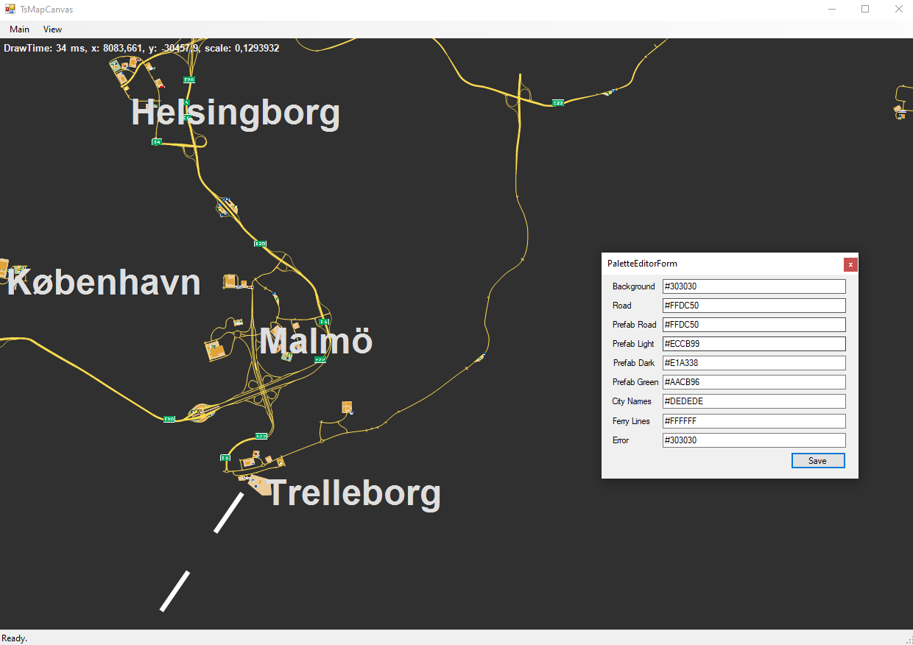
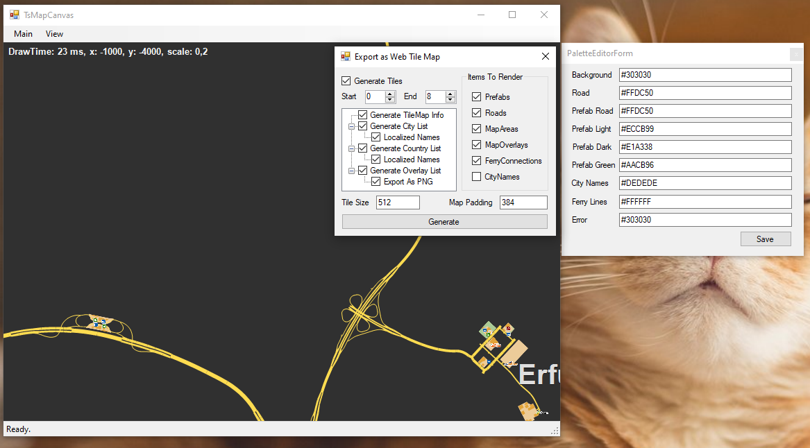

# ETS2 / ATS Mobile Route Advisor    
Euro Truck Simulator 2 / American Truck Simulator's Route Advisor, for mobile devices.
This is a skin for funbit's [ETS2 Telemetry Server](https://github.com/Funbit/ets2-telemetry-server).

## Features
The mobile Route Advisor is planned to include all features that Euro Truck Simulator 2 / American Truck Simulator's Route Advisor currently has. These features are:

- Navigation
    - Mini-map (ETS2 & ATS)
        - Fixed on truck, up is always north
        - Fixed on truck, map rotates so up is direction truck is facing
        - Free view/rotate/zoom
		- Auto zoom map depending on speed
    - Speed limit
    - Distance Remaining
    - Estimated time of arrival (ETA)
    - Time to destination
- Current job information
    - Current load
    - Destination city
    - Payout
    - Time remaining
    - Time until next rest
- Truck damage / load damage
- Localization support
- [Various configuration options](https://github.com/mike-koch/ets2-mobile-route-advisor/wiki/config.json-Parameters)

## Requirements
- Euro Truck Simulator 2 and/or American Truck Simulator
- [ETS2 Telemetry Server](https://github.com/Funbit/ets2-telemetry-server) 3.2.5 or later

## How to Install
1. Download the latest version of the Mobile Route Advisor from either the [official website](http://www.mikekoch.me/ets2-mobile-route-advisor), or from the [releases page](https://www.github.com/mike-koch/ets2-mobile-route-advisor/releases).
2. Extract the contents of the zip to the ETS2 Telemetry Server's `/server/Html/skins` directory. You should then have a folder named `ets2-mobile-route-advisor` in the `skins` directory.

## How to Capture map in future game versions
1. Download the latest version of the ts-map from either the [official website](https://github.com/dariowouters/ts-map), or from the [compiled version zip archive](https://meatlayer.github.io/ets2-mobile-route-advisor/ts-map_v139_compiled.zip) for ets2 / ats version v1.38.
2. Extract the contents of the zip in your PC disk `C:\ts-map` directory. Run `TsMap.Canvas` app.
3. Select the game folder, for example C:\Program Files (x86)\Steam\steamapps\common\Euro Truck Simulator 2 and press Continue.
4. After successfully opening the map in the app, configure the color palette in the menu. Example in the screenshot: 

5. Run Main - Generate tile map, set the capture parameters according to the parameters in the screenshot (Start: 0, End: 8, 512px tile size, padding 384, checkbox "CityNames" disable)

Press Generate, Select a folder, for example C:/ets2-map, and waiting, this process can take an average of 15 minutes on fast PCs: i7 7700k, GTX1070, NVME 1TB.

6. After the operation is completed, the finished tiles will be stored in the folder C:/ets2-map/Tiles these folders 0 1 2 3 4 5 6 7 8 will need to be placed in ets2-mobile-route-advisor.

7. After completing the operation, you may need a file with the coordinates of the cities it will be in the file C:/ets2-map/Cities.json its contents will need to be adapted to the file ets2-mobile-route-advisor\maps\ets2\js\cities.js - it's quite simple, just compare their contents.

8. Minor edits may be required, but otherwise, the most difficult part is capturing the tile map. And if you have successfully completed this step, the rest should not be difficult. Enjoy :)

## Support
If you require any type of support, please looking at the [contributing guidelines](https://github.com/mike-koch/ets2-mobile-route-advisor/blob/master/CONTRIBUTING.md) to see where you should post your request. **Please do not contact me directly via e-mail, as your e-mail will be ignored.**

## Languages
A list of supported languages are available on the [ets2-mobile-route-advisor website](http://mikekoch.me/ets2-mobile-route-advisor). If you would like to submit a translation, please submit a pull request.

## Screenshots

## Contributors
<table>
    <tr>
        <th>Development</th>
        <th>Translations</th>
        <th>Map</th>
    </tr>
    <tr>
        <td valign="top">
            <ul>
                <li><a href="https://github.com/mike-koch">mike-koch</a></li>
                <li><a href="https://github.com/denilsonsa">denilsonsa</a></li>
                <li><a href="https://github.com/Koenvh1">Koen</a></li>
            </ul>
        </td>
        <td valign="top">
            <ul>
                <li><a href="https://github.com/mike-koch">mike-koch</a></li>
                <li><a href="https://github.com/Phil0499">Phil0499</a></li>
                <li><a href="https://github.com/raflix261">raflix261</a></li>
                <li><a href="https://github.com/pedropandolfi">pedropandolfi</a></li>
                <li><a href="http://forum.scssoft.com/memberlist.php?mode=viewprofile&u=127033">MinecraftMarioGuy53</a></li>
                <li><a href="http://forum.scssoft.com/memberlist.php?mode=viewprofile&u=3710">SchorschiBW</a></li>
                <li><a href="https://github.com/denilsonsa">denilsonsa</a></li>
                <li>Frank Kristensen</li>
            </ul>
        </td>
        <td valign="top">
            <ul>
                <li><a href="https://github.com/Funbit">Funbit</a></li>
                <li><a href="https://github.com/Koenvh1">Koen</a></li>
				<li><a href="https://github.com/meatlayer">meatlayer</a></li>
            </ul>
        </td>
    </tr>
</table>
